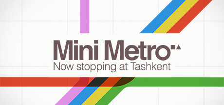
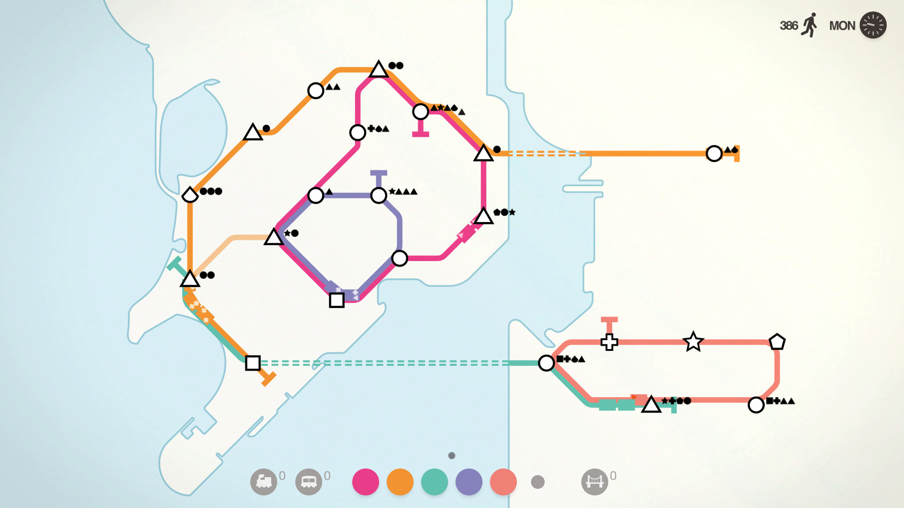
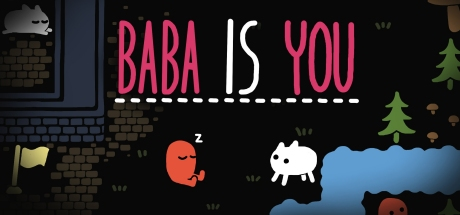
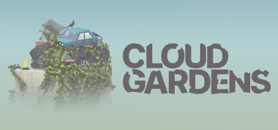
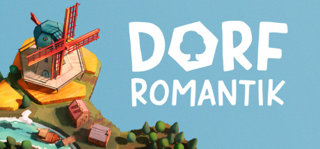
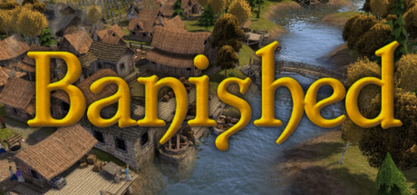

# Análisis de un Videojuego

``` cmd
Tarea realizada por Alejandro Pérez.
```

- [Análisis de un Videojuego](#análisis-de-un-videojuego)
  - [Enunciado](#enunciado)
  - [Mini Metro](#mini-metro)
    - [Orígenes](#orígenes)
    - [Gameplay](#gameplay)
    - [Sistema de juego](#sistema-de-juego)
      - [Líneas de metro](#líneas-de-metro)
      - [Locomotoras y vagones](#locomotoras-y-vagones)
      - [Estaciones](#estaciones)
      - [Tiempo](#tiempo)
      - [Game Over](#game-over)
      - [Win Condition](#win-condition)
    - [Cámara e iluminación](#cámara-e-iluminación)
    - [HUD](#hud)
    - [Assets Gráficos](#assets-gráficos)
    - [Sonido](#sonido)
  - [Baba is you](#baba-is-you)
    - [Gameplay](#gameplay-1)
    - [Historia](#historia)
  - [Conclusión](#conclusión)
  - [Bibliografía](#bibliografía)


## Enunciado

El objetivo de esta tarea consiste en realizar un análisis técnico de un videojuego desde el punto de vista del desarrollador, mostrando la información relativa a aspectos como la proyección de la cámara, los elementos que forman parte del juego, la iluminación, la disposición y configuración del HUD (Head Up Display), los sonidos... y todos aquellos elementos que consideréis interesantes.

Podéis hacer la tarea utilizando capturas de video y pantallazos que encontréis por la red del juego que escojáis. Os animo a que os fijéis en los detalles que suelen pasar inadvertidos.

No es necesario que el análisis sea extremadamente exhaustivo.

La tarea se deberá entregar en un documento en formato PDF.



## Mini Metro

En este juego conectas estaciones de metro para que los pasajeros que hay en ellas puedan llegar a su destino.

El objetivo del juego es evitar que estas estacione se saturen de pasajeros.

No hay mejor forma de entender cómo funciona un juego que viéndolo en acción, por eso dejo aquí enlazado el [trailer](https://www.youtube.com/watch?v=WJHKzzPtDDI) y una muestra de [gameplay](https://www.youtube.com/watch?v=MMmxDwy5cRA), no hace falta ver los vídeos ni verlos enteros, pero echarles un vistazo por encima puede ayudar a entender lo que viene ahora.

### Orígenes

Mini Metro nació como un juego de navegador en el año 2013. La versión final para ordenadores y jugable fuera de un navegador vió la luz en año 2015.

Actualmente cuenta con versiones para PC, Mac, Linux, Switch y Ps4.

### Gameplay



El juego empieza con tres estaciones de metro distintas, representadas por las formas geométricas blancas, que se empiezan a llenar de pasajeros, las formas pequeñas negras que se ven encima de las estaciones.

El jugador dispone de tres líneas de metro y tres locomotoras para interconectar las estaciones y conseguir que cada pasajero llegue a la estación deseada.

Si una estación se satura de pasajeros saldrá un aviso y un círculo de carga empezará a llenarse sobre la estación. Si este círculo se completa, la estación colapsa y se acaba la partida.

El objetivo es aguantar el mayor tiempo posible sin colapsos en las estaciones. No existe condición de victoria.

### Sistema de juego

#### Líneas de metro

El jugador puede conectar estaciones con las líneas de metro que tenga disponibles. Las líneas pueden cruzarse y puede haber varias líneas por estación. Para cruzar cuerpos de agua hacen falta puentes o túneles.

Una línea de metro puede ser circular.

El jugador puede modificar en juego el trazado de la línea de metro sin penalización alguna. Los trenes en trayecto afectados completarán el trayecto actual y se re-colocarán automáticamente.

Una línea de metro puede ser eliminada. Los trenes en trayecto lo acabarán depositarán todos sus viajeros en la siguiente estación y se guardarán.

#### Locomotoras y vagones

Un total de cuatro locomotoras pueden recorrer la misma línea de metro. Las locomotoras pueden recorrer la línea en cualquier dirección.

Una locomotora tiene espacio para 6 pasajeros. Cada vagón conectado a una locomotora permite viajar a otros 6 pasajeros.

#### Estaciones

A lo largo de la partida irán apareciendo nuevas estaciones simples y algunas estaciones únicas.

Las estaciones simples son:

- círculo
- cuadrado
- triángulo

Y las estaciones especiales son cualquier otra forma geométrica.

Los viajeros pueden hacer transbordo en una estación si así lo necesitan para llegar a su destino.

#### Tiempo

El juego puede acelerarse para que el tiempo transcurra más rápido y pausarse. Con el juego pausado se pueden re-colocar trenes y línea de metro.

Cada vez que el jugador complete una semana de juego, los días van pasando poco a poco, será recompensado con una nueva locomotora y una de los siguientes opciones:

- Una nueva línea de metro.
- Dos vagones que aumentan la capacidad de viajeros de la locomotora que los remolca.
- Dos túneles o puentes.
- Un intercambiador que aumenta la capacidad de viajeros y reduce el tiempo de saturación de la estación sobre la cual sea colocado.
- Recompensa especial según el mapa jugado.

Se le dará a elegir al jugador entre dos opciones aleatorias.


#### Game Over

La partida acaba cuando una estación se satura de pasajeros.

#### Win Condition

No existe condición de victoria. El objetivo del juego es aguantar el mayor tiempo posible en partida y transportar el mayor número de pasajeros.

### Cámara e iluminación

Vista cenital ortográfica para poder ver en todo momento la totalidad del campo de juego sin distorsiones. La iluminación es plana, sin sombras.

### HUD

Vamos a ver por separado los elementos de la parte superior e inferior de la pantalla.

En la parte superior de la pantalla de juego aparecen en orden:

- Una flecha para volver al menú de selección de mapa.
- El número total de pasajeros transportados durante la partida.
- El día actual de la semana y el control de la velocidad del juego *(tras pinchar sobre el día de la semana)*.


En la parte inferior se ven en orden:

- El número disponible de locomotoras y vagones. Las locomotoras y vagones en uso *(dentro del tablón de juego)* no cuentan como libres.
- Las líneas de metro desbloqueadas.
- El número de puentes o túneles disponibles, dependiendo del mapa. Igual que con las locomotoras, los puentes o túneles en uso no cuentan como disponibles.


### Assets Gráficos

Todo el apartado gráfico de este juego, desde los menús hasta la pantalla de juego, es increíblemente simple y minimalista. Todo son formas geométricas sencillas y colores planos. Más que el arte de un videojuego parece un trabajo de diseño gráfico.


Esta simplicidad permite centrarse más en el gameplay y evita distracciones innecesarias.

### Sonido

El apartado sonoro, al igual que el gráfico, es minimalista. Consta de:

- Una música de fondo poco intrusiva.
- Unos pocos efectos de sonido a la hora de interactuar con el juego, por ejemplo al pinchar sobre una línea de metro, o cuando ocurre un evento.
- Finalmente un aviso o alerta cuando una estación se encuentra cerca del colapso.



## Baba is you

No voy a realizar un análisis como tal de este juego, ya que ya he analizado los componentes del Mini Metro, pero igualmente me apetecía mencionarlo por lo curioso que es.

Dejo aquí un link al [trailer](https://cdn.akamai.steamstatic.com/steam/apps/256743354/movie480.webm?t=1550681204) y a un [gameplay](https://www.youtube.com/watch?v=dAiX8s-Eu7w) que muestra muy bien los principios del juego.

Baba is You es en esencia, un juego de puzzles. Las normas del juego están dictadas por los enunciados formados con los bloques que se encuentran en la pantalla.

### Gameplay

Debajo podemos ver un ejemplo de pantalla de juego:


En esta pantalla podemos ver por ejemplo que:

- Baba *(el conejito)* eres tú *(el jugador o la jugadora)*.
- La llave es abrir.
- El muro y la puerta son parar y cerrar.

Esto se interpreta así:

- Las acciones del jugador o jugadora controlan a Baba.
- La llave permite abrir cosas cerradas.
- El muro y la puerta impiden el paso.
- El muro y la puerta están cerrados y por lo tanto se pueden abrir.

Si movemos estos bloques al empujarlos podemos cambiar estas normas.

### Historia

Baba nació como tantos otros juegos indies, como idea loca en una game jam cuyo tema era *"Not There"*. El juego ganó en primer puesto en la game jam y se hizo muy popular en varios festivales indie. Arvi Teikari, su creador, decidió seguir con el desarrollo.

Para el juego final creó una pequeña historia para acompañar a los puzzles, decenas de mapas repartidos en varios mundos y realmente no tengo ni idea de cómo está programado todo esto por debajo, pero tiene que ser una locura muy interesante.

## Conclusión

He escogido estos dos pequeños juegos con la intención de mostrar que no todo tiene por que ser creado por un estudio AAA *(super-producción)* y un equipo de 300 personas. No todo son necesariamente tiros y guerras, ni abusos de poder o muestras de violencia. Hay muchos juegos que son simplemente pequeñas joyas que entretienen o se permiten el explorar otros mundos y conceptos.

El objetivo de los juegos es al fin y al cabo el de educar y entretener.

Para acabar simplemente quiero mencionar otros ejemplos de juegos que considero se salen de la norma de lo que mucha gente se imaginaría como *videojuegos* ya sea porque estén al límite de siquiera ser juegos, porque parezcan más un juego de mesa o porque son ejemplos raros en su género.

[](https://store.steampowered.com/app/1372320/Cloud_Gardens/)

**Cloud Gardens**: Ayudar a la naturaleza a reclamar paisajes post-apocalípticos plantando plantas y guiando su crecimiento. No contiene conflicto ni hay consecuencias por "perder la partida". El único objetivo del juego es relajarse y decorar con plantas el entorno.

[](https://store.steampowered.com/app/1455840/Dorfromantik/)

**DorfRomantik**: Rellenar un tablero colocando piezas de terreno e intentando que conecten lo mejor posible entre ellas.

[](https://store.steampowered.com/app/242920/Banished/)

**Banished**: Toma las riendas de un grupo de desterrados y ayúdales a sobrevivir en un nuevo territorio. Este juego se centra en la gestión y supervivencia del grupo sin necesidad de introducir el conflicto con otras sociedades.

## Bibliografía

Todas las capturas de pantallas han sido sacadas de la propia página de Steam del juego en cuestión o bien han sido tomadas por mi.

Los vídeos están sacados de YouTube, toda la información relevante al vídeo se puede ver pinchando en el enlace del propio vídeo.

Para las nociones usadas me he basado en los apuntes de clase para saber que se esperaba del análisis y en conocimientos que ya tenía traía yo de casa.
